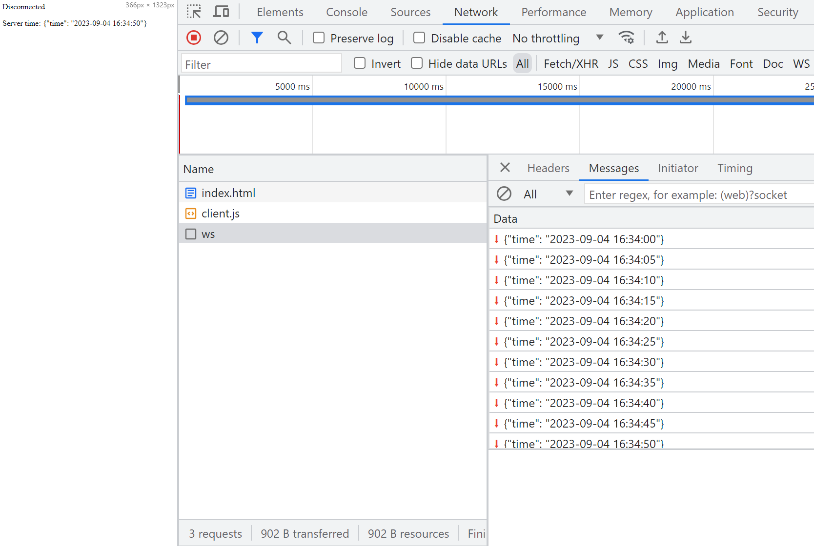

## Server - Client Communication

<section>

      

        Waldemar Sobiecki  
        Senior Fullstack Developer @ Ørsted   

 

</section>

---

  

     
Applications:

        <ul>
            <li>Live chat</li>
            <li>Multiplayer collaboration</li>
            <li>In-app alerts and notifications</li>
            <li>Realtime location tracking</li>
        </ul> 
    

  

    
    
  
    

---

##  HTTP Pooling, Websockets and ...

<!-- 
We'd like to solve a problem of **Immediate communication between services.**
User does not know how things work underneath, but he just wants
to see things quickly/have a feeling of an app being responsive. 

Example of apps:
Chat - Facebook, Telegram etc.
-->

---

# Examples

---

#### HTTP Pooling

--

#### HTTP Pooling

--

#### HTTP Pooling

--

#### HTTP Pooling

--

#### HTTP Pooling

--

#### HTTP Pooling

---

#### Websockets

--

#### Websockets

--

#### Websockets

--

#### Websockets

--

#### Websockets

--

#### Websockets

--

#### Websockets

--

#### Websockets

---

## server-sent events

--

## server-sent events

--

## server-sent events

--

## server-sent events

--

## server-sent events

--

--

## server-sent events

--

## server-sent events

--

## server-sent events

---

## Final Verdict?

---

 <table>
  <tr>
    <th>Pooling</th>
    <th>Websockets</th>
    <th>SSE</th>
  </tr>
  <tr class="pros">
    <td>Easy to implement</td>
    <td>Bi-directional Async</td>
    <td>Easy to implement</td>
  </tr>
  <tr class="cons">
    <td>Big overhead</td>
    <td class="pros">Binary & UTF-8</td>
    <td>No Binary Data</td>
  </tr>
  <tr class="cons">
    <td></td>
    <td>No automatic recovery socket.io</td>
    <td>Limited max connections  Solved with HTTP/2</td>
  </tr>
  <tr class="cons">
    <td></td>
    <td>Might need sticky sessions when H-scaling</td>
    <td></td>
  </tr>
</table> 

---

<!-- 2. Create hidden header/footer 
 -->

    

        

          
        

        

    

